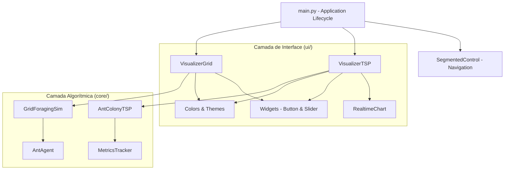
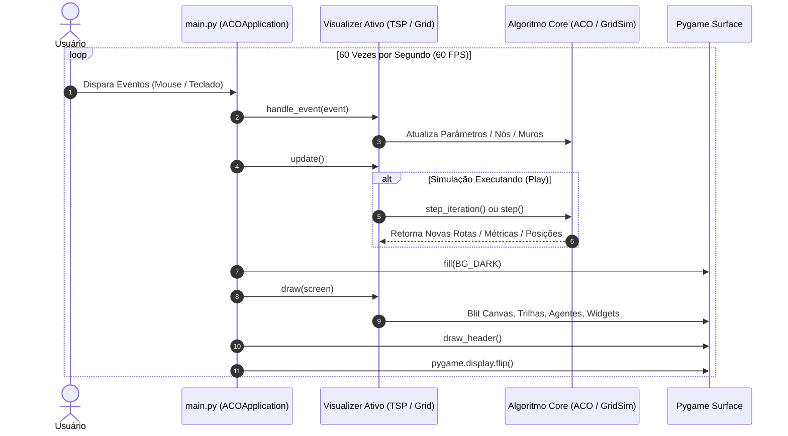

# Arquitetura do Projeto: Formigueiro ML

Este documento detalha a arquitetura de software, padrões de projeto, fluxo de dados e mecanismos de renderização do **Formigueiro ML** (*Ant Colony Optimization Visualizer*).

---

## 1. Visão Geral da Arquitetura

O projeto adota uma arquitetura modular desacoplada, separando estritamente a **lógica algorítmica e matemática** do **mecanismo de renderização gráfica e interface de usuário**.



---

## 2. Estrutura de Diretórios e Módulos

```
formigueiro_ML/
│
├── core/                       # Núcleo Algorítmico e Matemático (agnóstico de GUI)
│   ├── __init__.py             # Exportação das classes centrais
│   ├── aco_tsp.py              # Algoritmo ACO para o Caixeiro Viajante (TSP)
│   ├── grid_foraging.py        # Simulação de agentes contínuos em grade 2D
│   └── metrics.py              # Monitoramento de convergência e estatísticas
│
├── ui/                         # Camada de Apresentação e Interação Gráfica (Pygame)
│   ├── __init__.py             # Exportação dos componentes de interface
│   ├── colors.py               # Paleta de cores moderna (Dark Tech)
│   ├── widgets.py              # Componentes de UI (Button, Slider, SegmentedControl)
│   ├── chart_panel.py          # Renderizador de gráficos vetoriais em tempo real
│   ├── visualizer_tsp.py       # Controlador e tela do modo TSP
│   └── visualizer_grid.py      # Controlador e tela do modo Forrageamento/Labirinto
│
├── docs/                       # Documentação Técnica
│   ├── ARQUITETURA.md          # Especificação da arquitetura de software
│   └── TECNICA_ACO.md          # Fundamentação teórica e matemática do ACO
│
├── tests/                      # Bateria de Testes Automatizados
│   ├── test_aco.py             # Testes unitários do núcleo matemático
│   └── test_ui.py              # Testes de ciclo de vida da interface em modo headless
│
├── main.py                     # Ponto de entrada e gerenciador da aplicação
└── requirements.txt            # Dependências do ambiente Python
```

---

## 3. Descrição dos Componentes

### 3.1. Núcleo Algorítmico (`core/`)

- **`AntColonyTSP` (`core/aco_tsp.py`)**:
  - Implementa a metaheurística *Ant System* com extensões *Elitist* e *Min-Max Ant System (MMAS)*.
  - Armazena matriz de distâncias euclidianas $D$, matriz de visibilidade heurística $\eta = 1/D$ e matriz de feromônio $\tau$.
  - Método `step_iteration()`: executa um ciclo síncrono onde $m$ formigas geram permutações probabilísticas, atualizam a melhor rota global e realizam a evaporação e depósito de feromônio.
  - Suporta adição, remoção e reposicionamento dinâmico de nós em tempo de execução sem corromper o estado das matrizes.

- **`GridForagingSim` (`core/grid_foraging.py`)**:
  - Implementa uma simulação multiagente em espaço contínuo mapeado para matrizes 2D NumPy.
  - Cada agente (`AntAgent`) possui sensores direcionais (esquerda, centro, direita) para ler gradientes de concentração de feromônio.
  - Opera com matrizes duplas de feromônio: feromônio de retorno ao ninho (*Home*) e feromônio de condução ao recurso (*Food*).
  - Executa rotinas vetorizadas de difusão convolucional e evaporação temporal a cada frame.

- **`MetricsTracker` (`core/metrics.py`)**:
  - Mantém o histórico temporal de convergência: melhor fitness global, média da população por iteração, pior indivíduo e desvio-padrão (indicador de diversidade da colônia).

---

### 3.2. Camada de Interface Gráfica (`ui/`)

- **`VisualizerTSP` (`ui/visualizer_tsp.py`)**:
  - Gerencia o viewport do problema TSP (760x680 px) e a barra lateral de controles.
  - Renderiza trilhas de feromônio usando superfícies com transparência (*alpha blending*), onde a opacidade e a espessura da linha são proporcionais ao valor $\tau_{ij}$.
  - Renderiza animações contínuas de interpolação das formigas caminhando pelas arestas selecionadas.
  - Trata eventos de mouse: clique simples para criar nós, clique com botão direito para remover e arrastar para reposicionar.

- **`VisualizerGrid` (`ui/visualizer_grid.py`)**:
  - Renderiza o mapa de calor de feromônios através de conversão matricial RGB via `pygame.surfarray` para máxima performance sem perda de taxa de quadros (60 FPS).
  - Oferece ferramentas interativas de desenho de paredes, borracha, posicionamento de fontes de alimento e realocação do formigueiro.

- **`RealtimeChart` (`ui/chart_panel.py`)**:
  - Renderizador gráfico leve de alta performance integrado ao Pygame.
  - Plota curvas de convergência do melhor valor e da média populacional com autoescalonamento vertical e eixos dinâmicos.

- **`Button`, `Slider`, `SegmentedControl` (`ui/widgets.py`)**:
  - Widgets reutilizáveis com tratamento de hover, estados ativos, detecção de clique, restrições numéricas e formatação de texto customizada.

---

## 4. Ciclo de Execução Principal (Game Loop)

A aplicação segue o padrão clássico de **Game Loop** a 60 quadros por segundo:



---

## 5. Padrões de Projeto Utilizados

1. **Model-View-Controller (MVC adaptado)**:
   - *Model*: Classes de `core/` contêm o estado matemático e a física das formigas.
   - *View*: Módulos `visualizer_*.py`, `chart_panel.py` e `colors.py` cuidam da apresentação.
   - *Controller*: `main.py` e os handlers de evento nos visualizadores intermedeiam as ações do usuário.
2. **Strategy / Mode Switching**:
   - Alternância fluida entre o algoritmo combinatório discreto (TSP) e o sistema contínuo estigmérgico (Grid Foraging) mantendo a mesma janela e cabeçalho.
3. **State Pattern**:
   - Agentes de forrageamento transitam deterministicamente entre os estados `SEARCHING` e `RETURNING` conforme regras sensoriais de contato com comida ou ninho.
