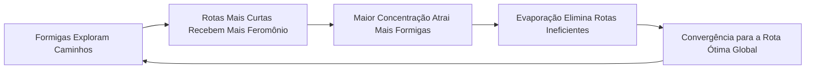

# A Técnica de Otimização por Colônia de Formigas (ACO)

Este documento apresenta a fundamentação teórica, a modelagem matemática e as aplicações em Machine Learning e Ciência da Computação do algoritmo de **Otimização por Colônia de Formigas (*Ant Colony Optimization - ACO*)**.

---

## 1. Inspiração Biológica e Estigmergia

O ACO é uma metaheurística inspirada no comportamento de forrageamento de colônias de formigas reais, introduzida inicialmente por **Marco Dorigo** em sua tese de doutorado em 1992 (*Ant System*).

### 1.1. O Princípio da Estigmergia
Formigas individuais possuem capacidades visuais e cognitivas limitadas, mas a colônia como um todo exibe comportamento inteligente complexo e auto-organizado. Esse fenômeno é mediado pela **estigmergia** (*stigmergy*): comunicação indireta entre agentes através de alterações no ambiente físico.

Ao caminhar entre o ninho e as fontes de alimento, as formigas depositam uma substância química volátil chamada **feromônio**:
1. Caminhos mais curtos são percorridos mais rapidamente.
2. Mais viagens de ida e volta ocorrem no mesmo intervalo de tempo.
3. A concentração de feromônio cresce mais rápido no trajeto mais curto.
4. Formigas subsequentes têm maior probabilidade de escolher caminhos com maior concentração de feromônio, gerando um ciclo de **retroalimentação positiva (*feedback loop*)**.

---

## 2. Modelagem Matemática do ACO

No contexto computacional, problemas de otimização combinatória são representados como grafos ponderados $G = (V, E)$, onde $V$ é o conjunto de vértices (cidades, estados, nós) e $E$ é o conjunto de arestas com custos associados (distâncias, latências, tempo).

Cada aresta $(i, j)$ possui dois valores fundamentais:
- **$\tau_{ij}$ (Feromônio)**: Representa a memória coletiva e o aprendizado adquirido pela colônia até o momento.
- **$\eta_{ij}$ (Informação Heurística)**: Representa a atratividade local imediata e independente de feromônio (em problemas de roteamento, $\eta_{ij} = \frac{1}{d_{ij}}$).

---

### 2.1. Regra de Decisão Probabilística (Roleta Ponderada)

Quando a formiga $k$ está no nó $i$, a probabilidade de selecionar o nó $j$ dentre as opções permitidas $\mathcal{N}_i^k$ é calculada por:

$$P_{ij}^k = \frac{[\tau_{ij}]^\alpha \cdot [\eta_{ij}]^\beta}{\sum_{l \in \mathcal{N}_i^k} [\tau_{il}]^\alpha \cdot [\eta_{il}]^\beta}$$

Onde:
- **$\alpha \ge 0$ (Sensibilidade ao Feromônio)**: Controla a importância da experiência coletiva. Se $\alpha = 0$, o algoritmo torna-se puramente guloso (*greedy*).
- **$\beta \ge 0$ (Sensibilidade Heurística)**: Controla o peso da atratividade local. Se $\beta = 0$, as formigas dependem exclusivamente dos feromônios sem avaliar a proximidade física.
- **$\mathcal{N}_i^k$**: Conjunto de nós vizinhos ainda não visitados pela formiga $k$ (assegurado por uma lista tabu/memória local).

---

### 2.2. Evaporação de Feromônio

Para evitar que o algoritmo fique preso em mínimos locais (*soluções subótimas prematuras*), o feromônio evapora gradualmente a cada iteração:

$$\tau_{ij} \leftarrow (1 - \rho) \cdot \tau_{ij}$$

Onde:
- **$\rho \in (0, 1]$ (Taxa de Evaporação)**: Determina a velocidade de decaimento do feromônio. 
  - Valores muito altos de $\rho$ esquecem rapidamente o histórico (podendo impedir o aprendizado).
  - Valores muito baixos de $\rho$ retêm feromônio antigo em excesso, atrasando a exploração de novas soluções.

---

### 2.3. Depósito de Feromônio

Após todas as $m$ formigas completarem suas rotas, cada uma deposita feromônio nas arestas que compõem sua solução:

$$\tau_{ij} \leftarrow \tau_{ij} + \sum_{k=1}^{m} \Delta \tau_{ij}^k$$

O valor depositado $\Delta \tau_{ij}^k$ é **inversamente proporcional** à qualidade/comprimento total $L_k$ do caminho percorrido:

$$\Delta \tau_{ij}^k = \begin{cases} \dfrac{Q}{L_k} & \text{se a aresta } (i, j) \text{ pertence ao tour da formiga } k \\ 0 & \text{caso contrário} \end{cases}$$

Onde $Q$ é uma constante de escala de depósito.

---

### 2.4. Variações Avançadas de ACO

1. **Elitist Ant System (EAS)**:
   - Aplica um reforço adicional na melhor rota global já encontrada na história da execução ($L_{\text{best}}$):
   $$\tau_{ij} \leftarrow \tau_{ij} + e \cdot \frac{Q}{L_{\text{best}}}$$
   - Acelera consideravelmente a convergência em grafos com grande número de vértices.

2. **Min-Max Ant System (MMAS)**:
   - Limita a intensidade dos feromônios dentro de um intervalo $[\tau_{\min}, \tau_{\max}]$:
   $$\tau_{ij} = \max(\tau_{\min}, \min(\tau_{\max}, \tau_{ij}))$$
   - Garante que nenhuma aresta tenha probabilidade zero de exploração, evitando a estagnação completa.

---

## 3. Aplicações do ACO em Machine Learning e IA

Além do clássico Problema do Caixeiro Viajante (TSP), a técnica de colônia de formigas é amplamente utilizada em diversas vertentes da Ciência de Dados:

### 3.1. Seleção de Características (*Feature Selection*)
- Em datasets com centenas de colunas/features, o ACO pode buscar o subconjunto ideal de atributos que maximize a acurácia de um classificador (como SVM ou Random Forest) minimizando a dimensionalidade.
- As formigas percorrem grafos onde cada nó representa uma feature; caminhos que produzem modelos com menor erro preditivo recebem maior depósito de feromônio.

### 3.2. Otimização de Hiperparâmetros e Arquiteturas Neurais
- Ajuste de taxa de aprendizado, dropout, número de camadas e neurônios em redes neurais profundas, onde o espaço de busca é não-convexo e de alta dimensionalidade.

### 3.3. Agrupamento de Dados Baseado em Formigas (*Ant-Based Clustering*)
- Inspirado no comportamento de formigas organizando cemitérios ou larvas. Agentes se movem em um espaço 2D pegando itens isolados e soltando-os próximo a itens semelhantes, formando clusters naturais de dados sem necessidade de definir o número $k$ de grupos a priori.

### 3.4. Roteamento em Redes e Veículos Autônomos (VRP / SDN)
- Planejamento de rotas logísticas dinâmicas com restrições de capacidade, janelas de tempo e desvio de congestionamentos em tempo real.

---

## 4. Comparativo de Metaheurísticas

| Característica | Ant Colony (ACO) | Algoritmos Genéticos (GA) | Particle Swarm (PSO) |
| :--- | :--- | :--- | :--- |
| **Inspiração** | Forrageamento de formigas / Feromônios | Evolução biológica e seleção natural | Revoada de pássaros / Cardumes |
| **Tipo de Busca** | Grafos e Otimização Combinatória | Vetores binários, inteiros ou reais | Espaços de parâmetros contínuos |
| **Memória** | Coletiva no ambiente ($\tau_{ij}$) | Na população de cromossomos | Individual ($p_{\text{best}}$) e Coletiva ($g_{\text{best}}$) |
| **Construção** | Probabilística incremental passo a passo | Cruzamento (crossover) e Mutação | Equações de velocidade e atração vetorial |
| **Ponto Forte** | Excelente para roteamento, caminhos e grafos | Grande flexibilidade de operadores | Rápida convergência contínua |
